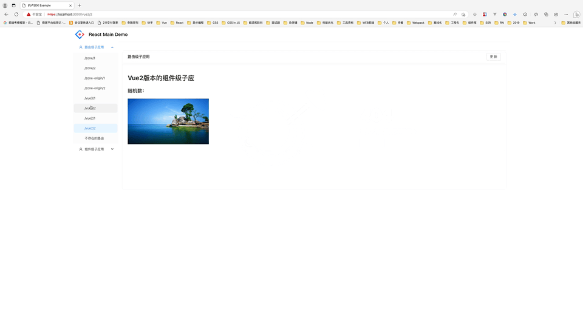

<p align="center">

  <a href="#">
    
  </a>
</p>

## Examples

在 example 文件夹内，有多个示例应用程序和多个已挂载的 Micro FE 应用程序。要使其运行，请首先克隆 dilu-sdk

```shell
$ git clone git@github.com:Kwai-Eshop/dilu-example.git
$ cd dilu-example
```

安装依赖和运行

```shell
$ yarn
# 启动react版本的主应用和所有子应用（react版本、vue2版本、vue3版本）
$ npm run example:react
# 启动vue2版本的主应用和所有子应用（react版本、vue2版本、vue3版本）
$ npm run example:vue2
# 启动vue3版本的主应用和所有子应用（react版本、vue2版本、vue3版本）
$ npm run example:vue3
```

访问 https://localhost:3000/


